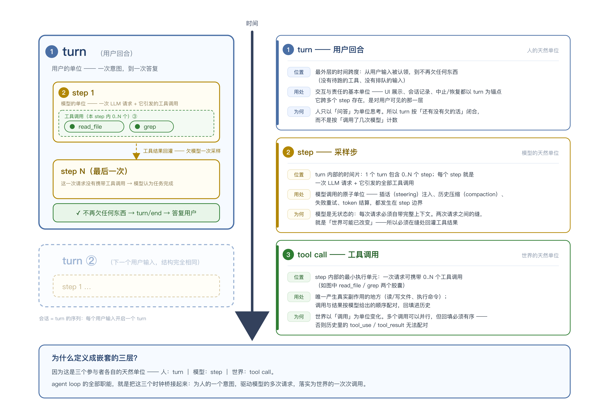
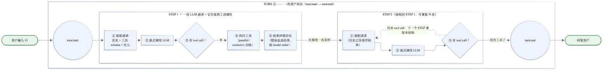
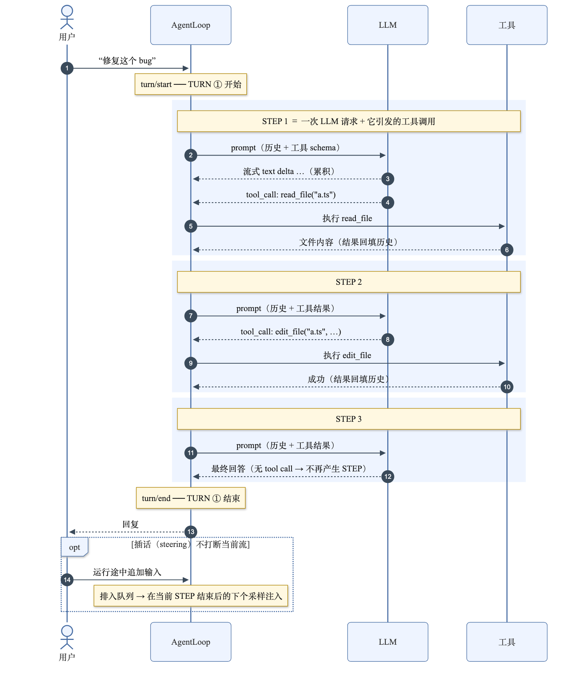
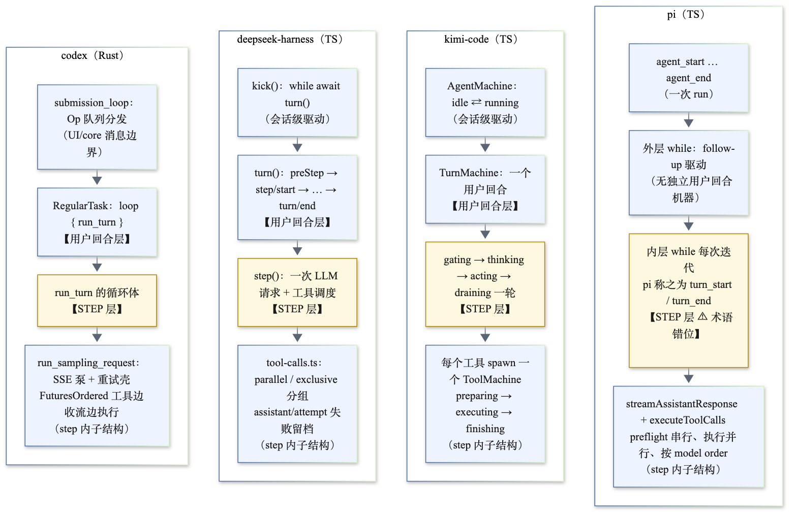

# Agent Loop 结构图：turn / step 层级

> 基于本目录四份调研（[codex](./codex.md) / [deepseek-harness](./deepseek-harness.md) / [kimi-code](./kimi-code.md) / [pi](./pi.md)）综合绘制。
> 四张图都在 [`diagrams/`](./diagrams/) 下（PNG 格式）。

## 零、概念图：三层各自在哪里、为何这样定义

先看这张抽象概念图——它回答的不是"流程怎么走"，而是：**turn / step / tool call 分别在哪里、用处是什么、为什么被定义成这样**。

核心命题：**嵌套的三层 = 三个参与者各自的天然单位**——

- **人以「问答」为单位思考** → 所以最外层是 **turn**，关闭条件是"不再欠任何东西"，而不是"调了几次模型"；
- **模型是无状态的，每次请求必须自洽** → 所以中间层是 **step**（一次请求 + 它引发的工具），两次请求之间的"缝"就是工具结果回灌点，也是插话/压缩/重试的落点；
- **世界以「调用」为单位变化** → 所以最内层是 **tool call**（真正的副作用），可并行但必须按序配对回填。

agent loop 的全部职能，就是把这三个时钟桥接起来。

## 一、总结构图

### 两个层级

| 层 | 定义 | 边界事件 |
|---|---|---|
| **turn**（用户回合） | 一次用户输入到最终答复；包含 0..N 个 step | `turn/start` → `turn/end` |
| **step** | **一次 LLM 请求 + 它引发的全部工具调用** | `step/start` → `step/end` |

deepseek-harness 官方文档里的定义最精确：

> "A step is one model request plus the tools it calls. A turn is zero or more steps: it opens before its first input is claimed and closes once nothing is owed."

一句话记忆：**step 是"采样单位"，turn 是"对话单位"**。模型每被叫一次（不管有没有调工具）就是一个 step。

### step 内部的五步（图中 ①–⑤）

1. **装配请求**：历史消息 + 工具 schema + 上下文注入（AGENTS.md / skill / 时间 / 引用等）
2. **流式调用 LLM**：累积 text delta 与 tool_call 参数 delta
3. **判定**：有 tool call 吗？
4. **执行工具**：按 parallel / exclusive 分组（有副作用、需独占的串行）
5. **结果回填历史**：错误也是结果（`isError` tool result）；按 model order 回填，保证 tool_use/tool_result 配对

### 循环规则：什么时候进入下一个 step，什么时候结束 turn

| 触发 | 行为 |
|---|---|
| 本 step 有 tool call | 结果回填 → **欠模型一次采样** → 进入下一个 step（图里 STEP 1 → STEP 2 的实线） |
| 本 step 没有 tool call | 模型认为完成 → turn 可以结束（`turn/end`） |
| steering（用户插话 / 队列输入） | 不打断当前流，在**下一个 step 边界**注入 → 即使没有 tool call 也触发下一个 step |
| follow-up（agent 停下后才该处理的输入） | 追加续跑：同一个 turn 重启（codex）或外层循环再入（pi） |
| 错误（非致命） | 结束本 turn 并报错，**会话不终止**，用户可继续（codex："let the user continue the conversation"） |
| abort（ESC） | 硬退出，丢弃当前输出。注意与 steering 区分：插话 ≠ 中断 |

## 二、时序视图：一次 turn = 3 个 step

注意 **STEP 3**：最后一次请求没有 tool call，不再产生新 step，turn 结束。因此规律是：

> **一个 turn 的 step 数 = 工具调用轮数 + 1**

图中底部还画了 steering 的位置：用户中途追加输入不会打断当前流，而是排入队列、在 step 边界注入。

## 三、四个实现如何映射到 turn / step

### 术语对照表

| 概念 | codex（Rust） | deepseek-harness | kimi-code | pi |
|---|---|---|---|---|
| 用户回合层 | turn（`run_turn`） | `turn()` | `TurnMachine` | ⚠ 无独立层：外层 while 由 follow-up 驱动 |
| **STEP 层** | sampling request（`run_sampling_request`） | `step()` | `gating → thinking → acting → draining` 一轮 | `turn_start` / `turn_end`（**术语错位**：pi 的 turn = 这里的 step） |
| step 内子结构 | SSE 事件泵 + 重试壳 + `FuturesOrdered` 工具池 | 流累积 + 原地重试 + 工具调度（parallel/exclusive） | `thinking`（LLM）+ `acting`（工具 actor） | `streamAssistantResponse` + `executeToolCalls` |

⚠ pi 是最容易混淆的：pi 事件流里的 `turn_start` / `turn_end` 包裹的是"一次 LLM 请求 + 工具"，对应本图的 **step**；pi 没有等价的"用户回合"层，agent 停下后由外层 while 消费 follow-up 继续跑。

### 四条实现各自在 turn/step 上的特色

**codex**
- turn 层是 `RegularTask` 的 `loop { run_turn }`：一轮 `run_turn` 结束后若输入队列还有东西，**同一 turn_id 重启**，而不是开新 turn。
- step 层由 `SamplingRequestResult { needs_follow_up }` 决定 continue / break；`Completed{end_turn: false}` 也会置 `needs_follow_up`。
- 两个 CancellationToken 区分语义：`preempt`（用户插话 → 保留输出、追加一次采样）vs 主 token（ESC → `TurnAborted` 丢弃）。

**deepseek-harness**
- turn/step 是一等公民：`turn/start`、`step/start`、`step/end`、`turn/end` 全部进 append-only 日志，可重放。
- turn 结束条件是 "nothing is owed"：无工具后续请求且 `inbox.nextStep` 为空。
- step 内有一个**原地重试循环**（`agent/request-error` waterfall），compaction 溢出恢复也在此重入；失败尝试写 `assistant/attempt`，不进模型历史。

**kimi-code**
- 用状态机表达 step：`gating`（前置钩子，compaction 在此挂载）→ `thinking`（LLM 流）→ `acting`（并行工具）→ `draining`（收割运行中涌入的通知/reminder）→ 回 `gating` 即下一个 step。
- `draining` 收到新消息会**重置步数**；`maxStepsPerTurn` 兜底防死循环。
- 每个工具是独立 `ToolMachine` actor；abort 时给未完成工具 2.5s 宽限再强制收齐。

**pi**
- 双层 while 显式对应两级：内层 = step（tool call / steering 驱动），外层 = follow-up 续跑。
- `stopReason === "length"`（输出截断）时**拒绝执行全部 tool call**，回 error result 让模型重发。
- `finishTurn` 钩子可返回 `end` 或显式 continue；一切策略（compaction、重试）都在钩子里，循环本体不含业务知识。

## 四、图片清单

| 文件 | 内容 |
|---|---|
| `turn-step-concept.png` | 概念图：三层结构 + 位置/用处/为何注释面板 |
| `turn-step-structure.png` | 总结构图（turn/step 层级 + 一次采样流程） |
| `turn-step-sequence.png` | 时序图（一次 turn = 3 个 step，含 steering 位置） |
| `implementations-layers.png` | 四个实现的层级对照（会话驱动 → turn → step → step 内） |
